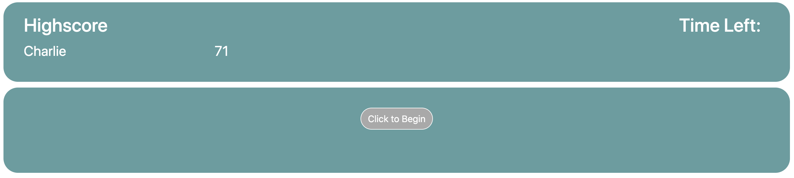
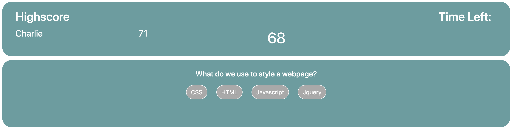
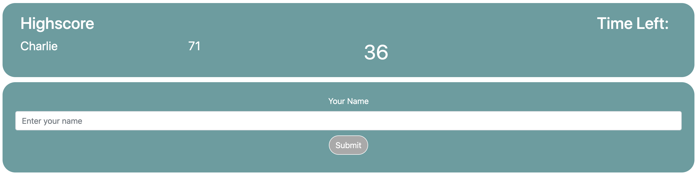

# -4-API-Coding-Quiz
A code quiz built with dynamic javascript.

This application is now live and deployed at: https://clatrobe00.github.io/-4-API-Coding-Quiz/

This application is now fully functional. This application is a multiple choice coding quiz with a timer. Once the start button has been clicked, the timer will initiate and the user will have 75 seconds to complete the quiz.

Once a question has been answered, the next question will display.

A wrong answer will cause ten seconds to be deducted from the user's time remaining.

Once the quiz has been completed, the user will be taken to a form where they may enter their name to be stored in local storage. Their name and score will be displayed at the top left of the application.

